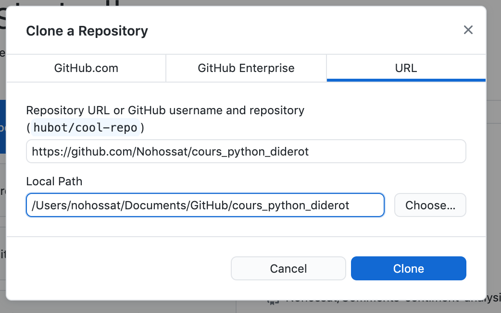
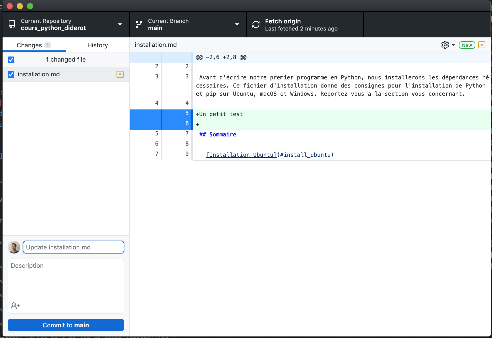

## Github Desktop

[Lien d'installation](https://desktop.github.com/)

### Installation du dépôt du cours

Une fois Github Desktop installé, vous pouvez le connecter à votre compte Github puis cloner le dépôt (repository) du cours (Clone a repository from the Internet). 

Puis cliquez sur le tab URL et copiez l'url : https://github.com/Nohossat/cours_python_diderot dans le premier champ. Dans le deuxième champ, vous pouvez indiquer le dossier dans lequel vous souhaitez copier le dépôt. Puis cliquez sur Clone.

Une fois le cours copié, vous retrouverez tous les fichiers à l'endroit indiqué dans **Local Path**.

Vous pouvez modifier les fichiers comme vous le souhaitez. 

### Sauvegarde des changements locaux

Vous verrez que lorsque vous modifiez un fichier, Github Desktop vous proposera de faire un commit (une sauvegarde de l'état du dêpot à un moment donné).

Vous pouvez le faire, les commits sont très utiles pour savoir les modifications qui ont été faites dans le temps et surtout revenir en arrière si besoin. 

### Actualisation du dépôt

Le dépôt distant (celui qui est accessible depuis mon compte) sera mis à jour régulièrement au fur et à mesure de notre avancement. Pour récupérer les dernières modifications, il faudra cliquer sur **Fetch origin**.