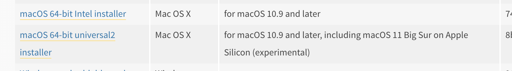
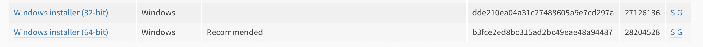

# Installation de Python 3.9 et pip

Avant d'écrire notre premier programme en Python, nous installerons les dépendances nécessaires. Ce fichier d'installation donne des consignes pour l'installation de Python et pip sur Ubuntu, macOS et Windows. Reportez-vous à la section vous concernant.

## Sommaire

- [Installation Ubuntu](#install_ubuntu)
- [Installation Mac](#install_mac)
- [Installation Windows](#install_windows)
- [Environnements virtuels](#envs)
    - [Introduction à pipenv (Ubuntu / macOS)](#pipenv)
    - [Introduction à virtualenv (Windows / Ubuntu / macOS)](#venv)
- [Installation de JupyterLab](#jupyter)

## <a name="install_ubuntu"></a> Installation Ubuntu

Sur Ubuntu, vous devriez avoir **Python 2.7** installé par défaut. 

Pour vous en assurer, vous pouvez lancer la commande `python -V` depuis votre Terminal.
Cette version étant bientôt obsolète, nous installerons la version 3.9.

```shell
sudo apt update
sudo apt install software-properties-common
sudo add-apt-repository ppa:deadsnakes/ppa
sudo apt update
sudo apt-get install python3.9 python3-pip
```

Python 3.9 est maintenant installé, vous pouvez vous en assurer en lançant la commande `python3.9 -V`.

Le gestionnaire de paquets Python, **pip** est aussi disponible. 
Lancez la commande `pip -V` pour voir s'afficher le numéro de version. 


## <a name="install_mac"></a> Installation macOS

Jusqu'à MacOS Mojave, Python 2.7 était pré-installé sur les ordinateurs Apple. Vous pouvez le vérifier en lançant la commande `python -V` dans votre Terminal. Comme pour Ubuntu, nous allons installer la dernière version de Python et pip. Contrairement à Ubuntu, on passera par les programmes d'installation présents sur le site officiel : [Python 3.9](https://www.python.org/downloads/release/python-391/).

Cliquez sur le lien **macOS 64-bit Intel installer** et suivez les instructions.



Vérifiez de nouveau la version de Python et la présence de **pip** avec la commande `pip -V`.

## <a name="install_windows"></a> Installation Windows

Python n'est pas présent par défaut sur Windows. 

Comme pour macOS, on passera par le site officiel de Python : [Python 3.9](https://www.python.org/downloads/release/python-391/).

Cliquez sur **Windows installer (64-bit)** et suivez les instructions. Lors de l'affichage du premier écran, n'oubliez pas de cocher la case **Add Python 3.9 to PATH**



Comme pour Ubuntu et macOs, vous pouvez vérifier la présence de Python et pip avec les commandes `python -V` et `pip -V`.

## <a name="envs"></a> Environnements virtuels

En allant sur le site officiel de Python, vous avez pu voir plusieurs versions du langage. Selon les modules et/ou projets, il se peut qu'une version autre que celle installée sur votre machine soit nécessaire au bon fonctionnement de votre programme. En outre, selon les projets, nous n'utiliserons pas nécessairement les mêmes versions de modules. 

Avant même de commencer à coder, je voudrais introduire la notion d'**environnement virtuel** pour que cela devienne un automatisme. Isoler le contexte de travail de chacun de vos projets facilitera la gestion des modules installés ou créés.

### <a name="pipenv"></a> Introduction à pipenv (Ubuntu / macOS)

J'utilisais régulièrement **virtualenv** pour la gestion de mes environnements virtuels mais j'ai découvert depuis peu **pipenv** et il inclut des fonctionnalités assez utiles. Malheureusement, il ne fonctionne que sous les systèmes Unix donc je mets aussi l'installation de virtuelenv ci-dessous pour ceux ayant Windows.

A ce niveau, vous devriez avoir Python et pip installés sur vos machines. Si ce n'est toujours pas le cas, écrivez-moi, on pourra voir ensemble ce qui bloque.

Pour installer un module Python, vous pouvez lancer la commande `pip install nom_module` depuis votre Terminal. Testons avec pipenv :

`pip install pipenv`

Une fois pipenv installé, créons notre premier environnement virtuel. Vous pouvez en créer un pour le cours. 

```shell
mkdir python_diderot && cd python_diderot
pipenv shell
```

La dernière commande créera un environnement virtuel, s'il n'existe pas. Deux fichiers seront créer à la racine de votre dossier **Pipfile** et **Pipfile.lock**.

- **Pipfile** : gère l'ensemble de vos dépendances en phase de développement et de production
- **Pipfile.lock** : dans le cas de l'export de votre projet, ce fichier indique les versions à utiliser pour chaque dépendance. Dans le cas de mises à jour des modules, votre projet continuera d'installer les versions permettant son bon fonctionnement. 

En lançant la commande `pipenv shell` vous devriez voir la localisation de l'environnement sur votre ordinateur.

Pour ajouter un module à votre environnement, il suffit de lancer la commande `pipenv install nom_package`. 

Pour désactiver un environnement, `pipenv exit`.

Pour désintaller tous les modules de l'environnement, `pipenv uninstall --all`.

Pour supprimer un environnement, la commande `pipenv --rm`. 

Pour voir les commandes possibles avec pipenv, vous pouvez lancer `pipenv -h`. 

### <a name="venv"></a> Introduction à virtualenv (Windows / Ubuntu / macOS)

Pour utiliser **virtualenv**, nous installerons d'abord le module : 

`pip install virtualenv`.

Une fois virtualenv installé, créons notre premier environnement virtuel. Vous pouvez en créer un pour le cours. 

```shell
mkdir python_diderot && cd python_diderot
virtualenv venv
```

**venv** est le nom par défaut de votre environnement. Un dossier du même nom sera créé à la racine de votre dossier. 

Pour activer votre environnement, lancer la commande `venv\Scripts\activate` si vous êtes sous Windows sinon `source venv/bin/activate.bat`.

Vous devriez voir l'environnement actif si son nom apparaît, entouré de parenthèses dans le terminal.

Pour installer / désintaller des modules, utilisez `pip install` / `pip uninstall`. 

Pour désactiver l'environnement, `deactivate`. 

Vous pouvez supprimer un environnement, en supprimant le dossier **venv**.

### <a name="jupyter"></a>Installation de JupyterLab

Si vous avez un environnement pipenv, lancer la commande `pipenv install jupyterlab` sinon `pip install jupyterlab`.

JupyterLab est la nouvelle interface web développé par le projet Jupyter. Elle permet de gérer des notebooks Jupyter (documents mêlant code, texte enrichi, images, graphiques, etc..). Les notebooks sont très utiles pour l'analyse exploratoire de données et le travail de recherche. Nous les utiliserons pour la suite des cours pour nous familiariser aux différentes commandes et aussi par la grande intéractivité qu'ils offrent.