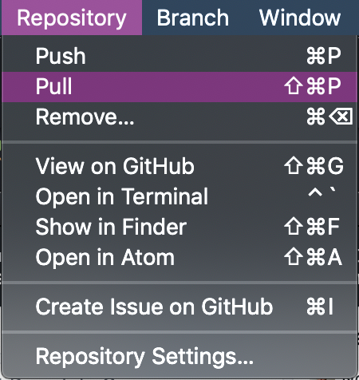

## Github Desktop

Comme précisé lors du cours d'introduction, nous allons utiliser Github pour actualiser les ressources du cours au cours du semestre. Pour ceux qui n'ont pas encore GitHub Desktop, je vous donne la marche à suivre pour l'installer et récupérer les ressources.

[Lien d'installation](https://desktop.github.com/)

### Installation du dépôt du cours

> Un dépôt : répertoire dans lequel est situé un projet qui est versioné avec GIT.

Une fois Github Desktop installé, vous pouvez le connecter à votre compte Github puis cloner le dépôt (repository) du cours (*Clone a repository from the Internet*) sur votre ordinateur.

Cliquez sur le tab **URL** et copiez l'url : https://github.com/Nohossat/cours_python_diderot dans le premier champ. Dans le deuxième champ (Local Path), vous pouvez indiquer le dossier dans lequel vous souhaitez copier le dépôt. Puis cliquez sur Clone.

Une fois le cours copié, vous retrouverez tous les fichiers à l'endroit indiqué dans **Local Path**.

Vous pouvez modifier les fichiers comme vous le souhaitez. 

### Sauvegarde des changements locaux

Vous verrez que lorsque vous modifiez un fichier, Github Desktop vous proposera de faire un commit (une capture de l'état d'un répertoire à un instant T).

Les commits sont très utiles pour avoir un historique des changements du répertoire mais surtout pouvoir revenir sur certains d'entre eux en cas d'erreur. 

### Actualisation du répertoire

Le dépôt distant (celui qui est accessible depuis mon compte) sera mis à jour régulièrement au fur et à mesure de notre avancement. Pour récupérer les dernières modifications, vous verrez dans le menu, un onglet **Repository**, en le survolant, vous aurez un menu déroulant, cliquez sur **Pull**. 

Avec cette action, plus besoin de télécharger de documents, Git recupère la dernière version du cours. 